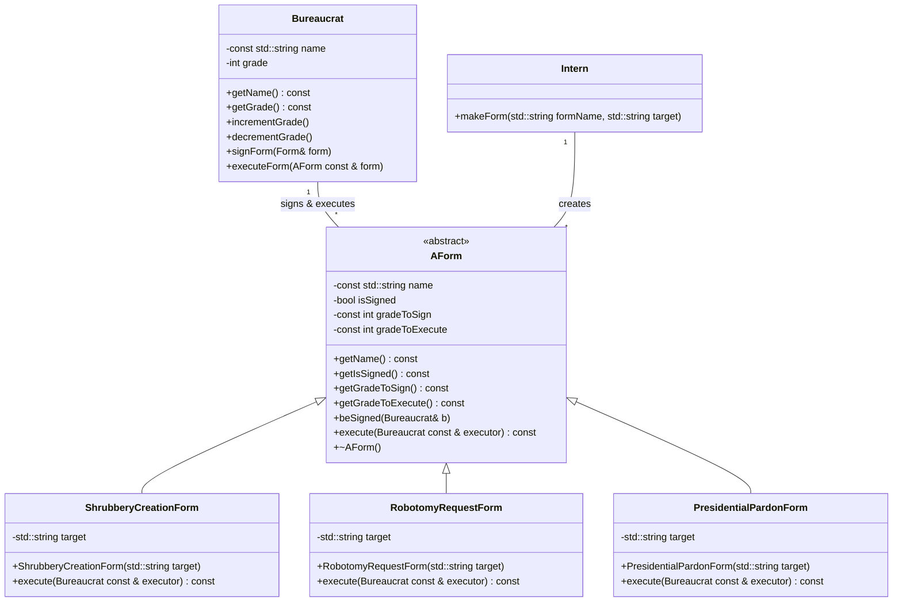

# C++ Module 05: Repetition and Exceptions

This module focuses on fundamental Object-Oriented Programming (OOP) concepts in C++, specifically delving into class design, inheritance, polymorphism, and exception handling. The exercises introduce a bureaucratic system simulation to explore these concepts in a practical context.

## General Rules and Guidelines

Based on the `en.subject.pdf` provided, the following general rules and guidelines apply to this module:

*   **Compiling:** All code must be compiled with `c++` using the flags `-Wall -Wextra -Werror`. The code should also compile with `-std=c++98`.
*   **Formatting and Naming Conventions:**
    *   Exercise directories are named `ex00`, `ex01`, etc.
    *   Class names are in `UpperCamelCase` format. Files containing class code are named after the class (e.g., `ClassName.hpp`, `ClassName.cpp`).
    *   Output messages must end with a newline character and be displayed to standard output.
    *   No specific coding style (Norminette) is enforced, but readability is crucial.
*   **Allowed/Forbidden:**
    *   Most of the standard library is allowed; prefer C++-ish versions of C functions.
    *   C++11 (and derived forms) and Boost libraries are forbidden.
    *   Functions like `*printf()`, `*alloc()`, and `free()` are forbidden.
    *   `using namespace <ns_name>` and `friend` keywords are forbidden unless explicitly stated.
    *   STL containers and algorithms (`<vector>`, `<list>`, `<map>`, `<algorithm>`) are forbidden until Modules 08 and 09.
*   **Design Requirements:**
    *   Avoid memory leaks (use `new` with `delete`).
    *   Classes must generally follow the **Orthodox Canonical Form** (constructor, default constructor, copy constructor, copy assignment operator, destructor).
    *   Function implementations in header files (except for templates) are forbidden.
    *   Headers must be independent and include all necessary dependencies, using include guards to prevent double inclusion.

## Exercises

### Exercise 00: Mommy, when I grow up, I want to be a bureaucrat!

**Objective:** Introduce the `Bureaucrat` class, focusing on its attributes, grade management, and exception handling.

**Key Concepts:** Class definition, constructors, getters, member functions for grade increment/decrement, custom exception classes (`GradeTooHighException`, `GradeTooLowException`), and operator overloading (`<<`).

**Classes:**
*   [`Bureaucrat`](./ex00/Bureaucrat.hpp)

**Files to Submit:** `Makefile`, `main.cpp`, `Bureaucrat.hpp`, `Bureaucrat.cpp`

### Exercise 01: Form up, maggots!

**Objective:** Introduce the `Form` class and establish an interaction between `Bureaucrat` and `Form` objects, specifically for signing forms.

**Key Concepts:** Class definition, boolean status, constant grades for signing and execution, getters, operator overloading, and the `beSigned()` and `signForm()` member functions, including exception handling for grade checks.

**Classes:**
*   [`Bureaucrat`](./ex01/Bureaucrat.hpp)
*   [`Form`](./ex01/Form.hpp)

**Files to Submit:** `Makefile`, `main.cpp`, `Bureaucrat.hpp`, `Bureaucrat.cpp`, `Form.hpp`, `Form.cpp`

### Exercise 02: No, you need form 28B, not 28C...

**Objective:** Implement an abstract `AForm` class and several concrete derived form classes with specific actions, demonstrating inheritance and polymorphism.

**Key Concepts:** Abstract base classes, inheritance, polymorphism, concrete derived classes (`ShrubberyCreationForm`, `RobotomyRequestForm`, `PresidentialPardonForm`), and execution of form actions with grade and signed status checks.

**Classes:**
*   [`AForm`](./ex02/AForm.hpp) (abstract base class)
*   [`ShrubberyCreationForm`](./ex02/ShrubberyCreationForm.hpp)
*   [`RobotomyRequestForm`](./ex02/RobotomyRequestForm.hpp)
*   [`PresidentialPardonForm`](./ex02/PresidentialPardonForm.hpp)
*   [`Bureaucrat`](./ex02/Bureaucrat.hpp)

**Files to Submit:** `Makefile`, `main.cpp`, `Bureaucrat.hpp`, `Bureaucrat.cpp`, `AForm.hpp`, `AForm.cpp`, `ShrubberyCreationForm.hpp`, `ShrubberyCreationForm.cpp`, `RobotomyRequestForm.hpp`, `RobotomyRequestForm.cpp`, `PresidentialPardonForm.hpp`, `PresidentialPardonForm.cpp`

### Exercise 03: At least this beats coffee-making

**Objective:** Implement an `Intern` class capable of creating various `AForm` objects dynamically based on string input, showcasing a factory-like pattern.

**Key Concepts:** Factory pattern (implicit), dynamic object creation, string-based form instantiation, and error handling for unknown form types. Emphasis is placed on avoiding messy `if/else if` structures.

**Classes:**
*   [`Intern`](./ex03/Intern.hpp)
*   [`AForm`](./ex03/AForm.hpp)
*   All concrete form classes from Exercise 02.

**Files to Submit:** `Makefile`, `main.cpp`, `Bureaucrat.hpp`, `Bureaucrat.cpp`, `AForm.hpp`, `AForm.cpp`, `ShrubberyCreationForm.hpp`, `ShrubberyCreationForm.cpp`, `RobotomyRequestForm.hpp`, `RobotomyRequestForm.cpp`, `PresidentialPardonForm.hpp`, `PresidentialPardonForm.cpp`, `Intern.hpp`, `Intern.cpp`

## Compilation Instructions

To compile any of the exercises, navigate to the respective exercise directory (`ex00`, `ex01`, `ex02`, or `ex03`) and run the `make` command:

```bash
cd cpp05/ex00
make
./ex00
```

Replace `ex00` with the desired exercise directory. To clean up the compiled files, use `make clean`:

```bash
cd cpp05/ex00
make clean
```

## Class Diagram for Exercise 02/03

Here is a simplified Mermaid class diagram illustrating the inheritance hierarchy of forms, as introduced in Exercise 02 and used in Exercise 03:


